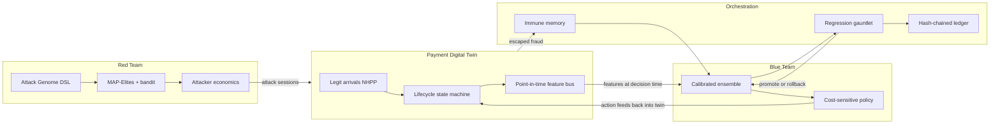

# Architecture

## The closed loop

## Two frozen contracts

Everything else can change, but these two interfaces are fixed so the twin and the teams stay
decoupled:

1. **RiskDecisionEngine** (`src/hydraloop/twin/decision.py`). The twin calls `decide(ctx)` at
   `AUTH_REQUEST` time and receives an `Action`. The Phase 1 no-op engine and the Phase 5
   cost-sensitive policy are drop-in swappable because they share this contract.
2. **Attack Genome DSL** (`src/hydraloop/red/dsl/spec.py`). Every attack is a validated genome
   with hard bounds. The JSON Schema (`catalog/genome.schema.json`) is generated from this one
   executable table, so the constrained output space is defined in exactly one place.

## Point-in-time correctness

The feature bus runs inside the twin at decision time and freezes its output into the
transaction record. A feature can only read state that exists at `as_of`, so future information
cannot leak into training data by construction rather than by a downstream check. The graph
snapshot applies the same `as_of` filter to edges, and a dedicated leakage test enforces it.

## Determinism

A seeded RNG registry and an event clock with a `sequence_no` tie-breaker make every run
reproducible. The `run_manifest.json` records the config hash so artefacts trace back to the
exact configuration that produced them.

## Data flow across a generation

1. The red team proposes genomes; the interpreter turns them into concrete twin sessions under
   a resource budget.
2. The twin simulates legit plus adversarial traffic and freezes point-in-time features.
3. The blue ensemble scores each transaction; the policy chooses an action against the cost
   matrix and friction budgets.
4. Escaped fraud is clustered and added to immune memory.
5. A candidate detector retrains on immune memory and faces the gauntlet (recall, FPR, ECE).
6. Promotion or rollback is recorded as a hash-chained ledger entry.

## Package layout

- `twin/` discrete-event simulator, lifecycle, feature bus, decision contract
- `red/` genome DSL, interpreter, economics, MAP-Elites, bandit, strategist
- `blue/` feature bus adapter, models, calibration, ensemble, cost-sensitive policy
- `loop/` orchestrator, immune memory, escape analysis, regression gauntlet, ledger
- `evaluation/` metrics, fidelity, LOFO, zero-day, drift, sensitivity, data adapter
- `api/` FastAPI REST plus the arena WebSocket, projecting on-disk runs
- `ui/` Next.js command center with an offline seed fallback
