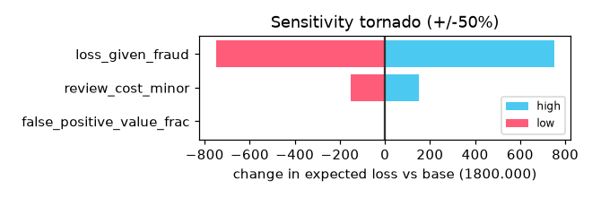

# Evaluation report

- run: example_eval

## LOFO transfer (train row -> test col), recall@1%FPR

| train\test | synthetic_identity | account_takeover | social_engineering | merchant_abuse | card_testing | money_movement |
|---|---|---|---|---|---|---|
| synthetic_identity | 0.88 | 0.52 | 0.50 | 0.60 | 0.27 | 0.27 |
| account_takeover | 0.32 | 0.48 | 0.22 | 0.07 | 0.00 | 0.02 |
| social_engineering | 0.78 | 0.40 | 0.65 | 0.77 | 0.30 | 0.68 |
| merchant_abuse | 0.08 | 0.07 | 0.12 | 0.10 | 0.53 | 0.00 |
| card_testing | 0.00 | 0.00 | 0.00 | 0.00 | 0.97 | 0.00 |
| money_movement | 0.52 | 0.05 | 0.15 | 0.10 | 0.00 | 0.80 |

- weak transfer cells (recall < 0.30): 19
- zero-day supervised recall: 0.125
- zero-day sentinel recall: 0.4583333333333333
- adversarial holdout escape rate (frozen model): 0.04166666666666663
- drift hook: stable PSI 0.048 (flag False), injected-shift PSI 9.406 (flag True)
- fidelity discriminator AUC (fallback): 0.5403686406486288

## Sensitivity tornado (+/-50%)

